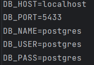

## Добро пожаловать в PyWIN Core


>  <h1>Hey✌️</h1>
> <p><b>PyWIN Core is a development software for creating your own GDPS, written in python</b></p>

> ### This gdps core can work with different versions of Geometry Dash
> 


> ## Plugin  System
> 
> The main idea on PyWIN in a large plugin system that is currently being developed.
> Below you can see an example of future plugins

```python
# discord client
import pywincord
from pywincord.wrapper import icons, difficulty


app = PyWIN()

@app.GDPSEvent('upload')
def discord_message(lvl):
    embed = pywincord(
        title = "New level in a GDCloud GDPS🥏"
        desc = f"{lvl.name} by {lvl.authorName} \n {icons.coins}{lvl.coins} | {icons.lenght} {lvl.lenght}"
        thumbnail = difficulty(lvl.difficulty)
    )
    pywincord.use_webhook(
        embed
    )
```

## Installation
> 
> ###  - Use dockerfile(recommended)
> In the config.json change 
> ``` "use_env": True,```
> 
> And also rename .env.example to .env
> 
> After these actions core will start taking data about the database and redis from .env, and not from config.json
> 
> ### Change database data. 
> State what the users will be called, what password and database will be used
> 
> 
>
> # Start server
> Use ```make build``` to download python with dependencies, and build project.
> 
> Use ```make run``` to run Postgresql , Adminer and your GDPS.
> 
> 
> Server starts on port 8000 by default, go ip:8000/database to check server status.

> ### -Non Docker
> Without dockerfile you will have to install all dependencies and database manually.
> 
>   Install dependencies `pip install -r requirements.txt`
>   
>   And select a database. 
    You can use Mysql, Postgresql, or the simplest - Sqlite
> 
>    Use `sh start.sh` to start server on 8000 port.
> 
> 
> 

